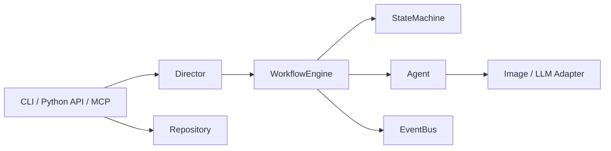
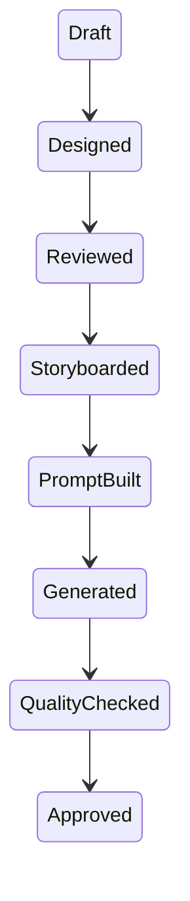
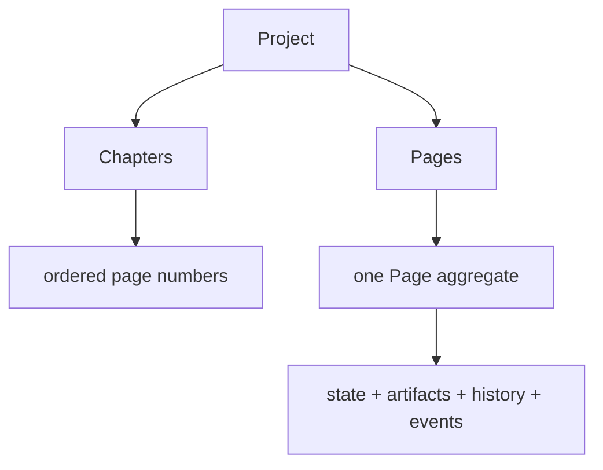

# manga-director

`manga-director` v6.0.0 is a typed, headless Python library and CLI for managing a commercial manga-production workflow one page at a time. It coordinates work; it is not an image model or a drawing UI.

> Stable release: Manga Production Platform v5.7 adds optional, read-only
> Production Workspace and Platform orchestration diagnostics. Platform API v1,
> Plugin SDK v1, and Workspace Standard v1 are frozen while preserving
> StateMachine authority. See the [v5.7 release notes](RELEASE_V5_7.md).

> Stable release: v6.0.0 adds optional Creative Production Platform
> foundation reports for Production Core, multi-project/workspace references,
> Knowledge, AI planning support, Collaboration, and Service Registry. These
> reports preserve all v5.x public surfaces and never execute a workflow.
> Iteration 2 adds read-only Knowledge Graph, Context Engine, Workflow
> Orchestrator, Automation Hub, Collaboration Workspace, Production Analytics,
> and Service Discovery projections. They report evidence only; they do not
> persist data, dispatch work, register services, or mutate a workflow.
> Iteration 3 completes the optional v6.0 Platform Kernel with Unified Context,
> Extension, SDK, Marketplace, Policy, Governance, and Observability reports.
> These additions are local, human-gated, and non-enforcing. The v6.0.0
> release is the current stable and v6.0.x is the compatibility baseline. See
> the [v6.0 release notes](RELEASE_V6_0.md).

> LTS: v6.0.x is the current Creative Production Platform maintenance line.
> It preserves the frozen Platform API, SDK, Extension API, and Marketplace
> Specification without adding execution behavior. See the [LTS policy](docs/V6_LTS_POLICY.md).

> Stable release: v5.4.0 completes the optional Creative Quality Framework
> Framework while preserving v5.0 LTS contracts for Python, CLI, MCP, Project,
> Repository, Plugin, Extension SDK, Provider, Image Backend, and page workflow.
> See the [v5.4 release notes](RELEASE_V5_4.md),
> [compatibility verification](docs/COMPATIBILITY_V5_4.md), and
> [release-ready report](docs/V5_4_RELEASE_READY_REPORT.md).

> The v5.0.0 LTS record is retained as historical compatibility context. v5.2
> automation is optional, local, declarative, human-gated, and requires no data
> migration.

v5.2 adds an optional Creative Automation Framework for local rule, event,
template, intelligence, governance, reliability, and lifecycle diagnostics. It
does not add an automation runtime. See the [v5.2 vision](docs/VISION_V5_2.md),
[automation roadmap](docs/ROADMAP_V5_2.md), and
[migration strategy](docs/MIGRATION_V5_1_TO_V5_2.md).

v5.3 adds an optional local **Creative Integration Framework** for Connector,
event-reference, data-exchange, and governance diagnostics without external
connectivity. See the [v5.3 vision](docs/VISION_V5_3.md),
[integration roadmap](docs/ROADMAP_V5_3.md), and
[migration strategy](docs/MIGRATION_V5_2_TO_V5_3.md).

v5.4 adds an optional, local **Creative Quality Framework Foundation** for
quality evidence, human review, validation, metrics, and release criteria. It
does not add automatic approval, workflow control, CI/CD control, or release
automation. See the [v5.4 vision](docs/VISION_V5_4.md),
[quality roadmap](docs/ROADMAP_V5_4.md), and
[migration strategy](docs/MIGRATION_V5_3_TO_V5_4.md), and
[Iteration 1 report](docs/V5_4_ITERATION_1_QUALITY_FOUNDATION_REPORT.md).

v5.4 Iteration 2 adds optional Quality Intelligence, review and validation
analytics, a human-gated release-readiness dashboard, and snapshot-only quality
monitoring. These are diagnostics only: they do not run reviews or CI/CD,
approve Pages, change workflows, persist monitoring data, or publish releases.
See the [Iteration 2 report](docs/V5_4_ITERATION_2_QUALITY_INTELLIGENCE_REPORT.md).

v5.4 Iteration 3 completes the local Quality Framework with non-enforcing
Governance, Review Audit, Validation Governance, Reliability, and Release
Lifecycle reports. These additions do not control policy, CI/CD, workflow,
approvals, recovery, or publication. See the
[Iteration 3 report](docs/V5_4_ITERATION_3_QUALITY_GOVERNANCE_REPORT.md).

v5.4.0 completes the optional Creative Quality Framework as a local,
human-gated diagnostic layer. It preserves v5.0 LTS and v5.3 contracts and adds
no policy enforcement, CI/CD control, approval, or release action. See
[the v5.4 release notes](RELEASE_V5_4.md).

v5.1 is a design-only, backward-compatible **Composable Creative Platform**
planning cycle. See the [v5.1 vision](docs/VISION_V5_1.md),
[modularization roadmap](docs/ROADMAP_V5_1.md), and
[v5.0 LTS to v5.1 migration strategy](docs/MIGRATION_V5_0_TO_V5_1.md).

Final validation details are recorded in the [One Creative Platform architecture summary](docs/ARCHITECTURE_SUMMARY_V5.md),
[workflow regression verification](docs/WORKFLOW_REGRESSION_V5.md),
[benchmark verification](docs/BENCHMARK_V5.md),
[security audit](docs/SECURITY_AUDIT_V5.md),
[package audit](docs/PACKAGE_AUDIT_V5.md), and
[release checklist](docs/RELEASE_CHECKLIST_V5.md).

## Features

- Forward-only, validated page workflow with explicit human approval
- Stateless agents and replaceable image-generator adapters
- Provider and image-backend metadata discovery with safe JSON/Markdown diagnostics
- Provider/backend lifecycle snapshots and metadata-only validation
- Configuration profiles, environment overrides, redacted snapshots, governance, and diffs
- JSON/YAML Project persistence for stopping and resuming work
- CLI and Python APIs built on the same `WorkflowEngine`
- Typed Pydantic models, structured errors, logging, Ruff, mypy, and pytest

## Architecture

```text
CLI / Python API
       |
       v
Director → WorkflowEngine → StateMachine → Agent → ImageGenerator
       |                         |
       v                         v
ProjectLoader → Repository     EventBus
```



The engine owns legal transitions and event publication. Agents do not manage state or invoke each other. Providers are selected by `ImageGeneratorFactory`, never by workflow or CLI conditionals.

For implementation detail and dependency direction, see [Architecture](docs/ARCHITECTURE.md).

## Workflow

```text
Draft → Designed → Reviewed → Storyboarded → PromptBuilt
      → Generated → QualityChecked → Approved
```

`run` stops at `QualityChecked`; `approve` is always explicit.



## Project Workflow

The Page workflow is unchanged and is now composed under sequential Project and
Chapter workflows:

```text
ProjectWorkflowEngine -> ChapterWorkflowEngine -> WorkflowEngine (one Page)
```

`project run PROJECT_ID` and `chapter run PROJECT_ID CHAPTER_ID` schedule only
the lowest-numbered non-approved page, then delegate it to the existing Page
`WorkflowEngine`. They stop at `QualityChecked`; use the existing explicit
`approve` command before the next page can progress. Project and Chapter
lifecycle events are persisted alongside aggregate history.

```bash
manga-director project create --id demo --title "Demo Manga"
manga-director project run demo
manga-director chapter status demo chapter-1
manga-director approve demo 1 --approved-by editor
manga-director project resume demo
```

See [Project Workflow](docs/project_workflow.md),
[Chapter Workflow](docs/chapter_workflow.md), and
[Workflow Hierarchy](docs/workflow_hierarchy.md).

## Batch Workflow

`BatchWorkflowEngine` is the persisted orchestration layer above Project and
Page workflows. It plans eligible pages in ascending page-number order and
delegates each Queue item to a Worker, which calls only the existing
`WorkflowEngine`. Each Worker invocation remains exactly one page; Batch does
not bypass state validation or human approval.

```bash
manga-director batch run demo --id chapter-production
manga-director batch status demo chapter-production
manga-director batch resume demo chapter-production
manga-director batch retry demo chapter-production
```

Only `SequentialExecution` performs work in this release. Queue, progress,
policy, logs, and lifecycle events persist under the Project so a stopped Batch
can resume without rerunning completed pages. `ParallelExecution` and
`AutoExecution` are typed extension points only; they launch no workers.

See [Batch Workflow](docs/batch_workflow.md),
[Execution Policy](docs/execution_policy.md), and [Worker Model](docs/worker_model.md).

### Large-project performance

Iteration 1 of the v2.2 cycle keeps the existing Repository and Workflow APIs
stable while adding opt-in selective reads for bundled repositories, metadata
listing, paginated history reads, indexed database lookups, and persisted
sequential Batch progress/checkpoints. Parallel execution remains intentionally
out of scope.

For operating guidance, see the [Large Project Guide](docs/LARGE_PROJECT_GUIDE.md),
[Performance Tuning](docs/PERFORMANCE_TUNING.md), [Batch Guide](docs/BATCH_GUIDE.md),
and the [v2.2 Iteration 1 Performance Report](docs/V2_2_ITERATION_1_PERFORMANCE_REPORT.md).

### Enterprise runtime operations

The optional `RepositoryScalability` helper provides cached project, chapter,
page, metadata, and snapshot indexes plus bounded history windows without
changing `ProjectRepository`. `LLMProviderRuntime` and `ImageBackendRuntime`
provide lifecycle snapshots (`ready` through `shutdown`) without changing the
provider protocols or invoking generation. `EnterpriseDiagnostics` composes
safe system, repository, provider, backend, configuration, performance, and
health summaries as JSON or Markdown.

See [Scalability](docs/SCALABILITY.md), [Provider Lifecycle](docs/PROVIDER_LIFECYCLE.md),
[Backend Lifecycle](docs/BACKEND_LIFECYCLE.md), and
[Configuration Governance](docs/CONFIGURATION_GOVERNANCE.md). For controlled
operation, see the [Enterprise Deployment Guide](docs/ENTERPRISE_DEPLOYMENT.md).
The implementation evidence is recorded in the
[v2.3 Iteration 2 Enterprise Runtime Report](docs/V2_3_ITERATION_2_ENTERPRISE_RUNTIME_REPORT.md).

### Runtime health and recovery

Runtime checks are DTO-only and isolated from workflow control flow. They cover
provider/backend construction health, repository integrity, workflow readiness,
configuration governance, Plugin/Extension diagnostics, and local system
status. Use `manga-director health summary`, `repository check`, `provider
check`, and `backend check` for safe operating evidence. Existing `health
check` and diagnostics commands remain available.

See [Health](docs/HEALTH.md), [Runtime Health](docs/RUNTIME_HEALTH.md),
[Diagnostics](docs/diagnostics.md), [Recovery](docs/RECOVERY.md), and
[Repository Integrity](docs/REPOSITORY_INTEGRITY.md).
Validation evidence is recorded in the
[v2.3 Iteration 3 Reliability Report](docs/V2_3_ITERATION_3_RELIABILITY_REPORT.md).

## Production runtime

The optional `manga_director.production` package adds an Application-layer,
mock-safe startup and shutdown coordinator. It validates injected configuration
and dependencies, warms local Provider/Image Backend metadata, and emits
transport-neutral startup, health, runtime-metrics, and diagnostic DTOs. It
never invokes a workflow, Agent, generation API, or network probe.

See [Production Runtime](docs/PRODUCTION_RUNTIME.md),
[Startup Sequence](docs/STARTUP_SEQUENCE.md),
[Health Monitoring](docs/HEALTH_MONITORING.md), and
[Observability Guide](docs/OBSERVABILITY_GUIDE.md). The stable deployment and
operations boundaries are described in the [v2.4 Production Deployment Guide](docs/PRODUCTION_DEPLOYMENT_V2_4.md)
and [v2.4 Operations Guide](docs/OPERATIONS_V2_4.md). Runnable local examples are
available in `examples/production_runtime`, `examples/startup_validation`,
`examples/health_monitoring`, `examples/provider_warmup`, and
`examples/runtime_report`.

### Operations management

`manga_director.production` also provides opt-in operational facades for safe
runtime configuration review, Provider/Image Backend inventories, persisted
health timelines, and composite JSON/Markdown diagnostics. These helpers use
existing configuration and Repository ports only; they do not select a Provider,
execute a workflow, or generate an image.

See [Runtime Configuration](docs/RUNTIME_CONFIGURATION.md),
[Provider Management](docs/PROVIDER_MANAGEMENT.md),
[Backend Management](docs/BACKEND_MANAGEMENT.md), and
[Health History](docs/HEALTH_HISTORY.md).

### Reliability operations

The optional reliability facade validates whether one persisted Page may resume,
checks workflow-history and Repository consistency, produces a non-executing
recovery simulation, and composes long-running stability and Production
Readiness DTOs. These are diagnostic controls only: they never run an Agent,
change a Page state, persist a repair, or bypass the StateMachine.

See [Reliability](docs/RELIABILITY.md), [Recovery Guide](docs/RECOVERY_GUIDE.md),
[Long-Running Operations](docs/LONG_RUNNING_OPERATIONS.md),
[Production Checklist](docs/PRODUCTION_CHECKLIST.md), and
[Diagnostics Reference](docs/DIAGNOSTICS_REFERENCE.md).

### Workflow planning and Provider orchestration

The optional `manga_director.production` planning facade provides read-only,
one-page workflow plans, dependency graphs, complexity and relative-execution
estimates, workflow intelligence, and metadata-only Provider recommendations.
It never calls an Agent or Provider, changes a WorkflowContext, schedules work,
or bypasses the StateMachine. Provider costs remain explicitly unknown and
fallbacks are recommendations only.

```bash
manga-director planning preview demo 1 --capability text
manga-director planning provider --capability deterministic
manga-director planning configuration
manga-director planning architecture
```

See [Workflow Planning](docs/WORKFLOW_PLANNING.md),
[Provider Selection](docs/PROVIDER_SELECTION.md),
[Workflow Intelligence](docs/WORKFLOW_INTELLIGENCE.md), and
[Planning Diagnostics](docs/PLANNING_DIAGNOSTICS.md). Runnable examples are in
`examples/workflow_planner`, `examples/execution_preview`,
`examples/provider_selection`, `examples/planning_summary`, and
`examples/workflow_analysis`.

### Workflow analytics and enterprise diagnostics

The analytics facade extends the advisory planning surface with one-page
dependency, complexity, bottleneck, critical-path, score, and comparison
analysis; Provider metadata/health comparisons; enterprise audits; bounded
operational trends; and executive summaries. These are read-only DTOs: they do
not invoke a Provider, change a Page, persist an update, schedule work, or take
an automatic action.

```bash
manga-director analytics workflow demo 1
manga-director analytics providers --capability text
manga-director analytics enterprise demo 1
manga-director analytics operations demo 1
manga-director analytics executive demo 1
```

See [Workflow Analysis](docs/WORKFLOW_ANALYSIS.md),
[Provider Optimization](docs/PROVIDER_OPTIMIZATION.md),
[Enterprise Diagnostics](docs/ENTERPRISE_DIAGNOSTICS.md), and
[Operational Analytics](docs/OPERATIONAL_ANALYTICS.md).

### AI workflow reliability and release readiness

The assurance facade adds read-only workflow integrity, validation, consistency,
risk, readiness, Provider governance, enterprise readiness, diagnostics, and
dashboard DTOs. They do not execute a workflow, call an AI Provider, change
configuration, deploy, repair Repository data, or publish a release.

```bash
manga-director assurance workflow demo 1
manga-director assurance providers
manga-director assurance enterprise demo 1
manga-director assurance diagnostics demo 1
manga-director assurance dashboard demo 1
```

See [Workflow Reliability](docs/WORKFLOW_RELIABILITY.md),
[Provider Governance](docs/PROVIDER_GOVERNANCE.md),
[Enterprise Readiness](docs/ENTERPRISE_READINESS.md), and
[AI Workflow Diagnostics](docs/AI_WORKFLOW_DIAGNOSTICS.md).

### AI Director reliability and Knowledge governance

The v2.7 Director surface adds advisory reliability, Knowledge governance,
enterprise AI readiness, diagnostics, and dashboard DTOs. These reports use a
single supplied Page context and the existing Repository port only. They do not
invoke Agents or Providers, change configuration, save data, schedule work,
deploy, publish, or transition workflow state.

```bash
manga-director director reliability --project demo --page 1
manga-director director governance
manga-director director readiness --project demo --page 1
manga-director director diagnostics --project demo --page 1
manga-director director executive --project demo --page 1
```

See [Director Reliability](docs/DIRECTOR_RELIABILITY.md),
[Knowledge Governance](docs/KNOWLEDGE_GOVERNANCE.md),
[Enterprise AI Readiness](docs/ENTERPRISE_AI_READINESS.md), and
[AI Workflow Diagnostics](docs/AI_WORKFLOW_DIAGNOSTICS.md).

## Quality automation and repository maintenance

The optional `manga_director.production` quality facade composes read-only
Repository, Workflow, Configuration, API, documentation, and release-artifact
validation DTOs. It also reports Repository statistics, integrity,
cleanup-candidate, and large-project evidence without changing the Repository
interface or workflow state. See [Quality Pipeline](docs/QUALITY_PIPELINE.md),
[Repository Maintenance](docs/REPOSITORY_MAINTENANCE.md),
[Developer Productivity](docs/DEVELOPER_PRODUCTIVITY.md), and
[Release Validation](docs/RELEASE_VALIDATION.md).

### Release and OSS readiness

`manga_director.production.ReleaseReadiness` composes passive reliability,
maintenance, release, contribution, governance, and license evidence into
JSON/Markdown DTOs. It neither executes workflow steps nor publishes a release
or contacts GitHub. See [Release Process](docs/RELEASE_PROCESS.md),
[Maintenance Guide](docs/MAINTENANCE_GUIDE.md), [Dependency Policy](docs/DEPENDENCY_POLICY.md),
and [OSS Readiness](docs/OSS_READINESS.md).

## MCP Server

The local MCP server exposes the same Application Service and validated Page
workflow used by CLI delivery. It runs only over standard input/output; it does
not expose HTTP, remote transport, authentication, or background workers.

```bash
manga-director mcp tools
manga-director mcp resources
manga-director mcp prompts
manga-director mcp serve
```

MCP tools operate one Page at a time and return a uniform DTO with `success`,
`operation`, `state`, `data`, `messages`, `errors`, and `metadata`. Approval is
available only from `QualityChecked`. See [MCP Server](docs/mcp_server.md),
[tools](docs/mcp_tools.md), [resources](docs/mcp_resources.md),
[prompts](docs/mcp_prompts.md), and [security](docs/mcp_security.md).

## Web UI

`web/` contains a minimal, independent Next.js + TypeScript App Router UI. It
contains a typed REST client and never imports Core, CLI, MCP, or repository
code. The optional `manga-director[api]` delivery adapter provides only the
documented observability DTO routes; it is not a general Web UI workflow API.

```bash
cd web
npm install
npm run dev
```

The UI includes Project, Chapter, and Page workflow views, loading/empty/error
states, responsive CSS, and unit/E2E starter tests. See [Web UI](docs/web_ui.md),
[frontend architecture](docs/frontend_architecture.md),
[API client](docs/api_client.md), [UI workflow](docs/ui_workflow.md), and
[accessibility](docs/accessibility.md).

## Installation

```bash
python -m pip install manga-director
```

## Database

SQLite and PostgreSQL are optional SQLAlchemy 2.x repository adapters. Configure
`database_provider` and `database_url`; existing file-backed projects continue
to use `repository.driver: local_file`. See [Database](docs/database.md),
[migrations](docs/migration.md), and [Unit of Work](docs/unit_of_work.md).

## Observability

Optional in-process observability provides workflow/agent metrics, trace and
correlation IDs, state timelines, health checks, and diagnostics without
changing workflow legality. See [Observability](docs/observability.md) and
[Diagnostics](docs/diagnostics.md). v2.5 adds the
[Observability Reference](docs/OBSERVABILITY_REFERENCE.md),
[Performance Analysis](docs/PERFORMANCE_ANALYSIS.md), and
[Operations Automation](docs/OPERATIONS_AUTOMATION.md) for transport-neutral
insight and planning DTOs. Runtime cache behavior is documented in
[Plugin Runtime](docs/PLUGIN_RUNTIME.md), [Extension Runtime](docs/EXTENSION_RUNTIME.md),
and [Configuration](docs/CONFIGURATION.md). Iteration 2 also documents
[performance](docs/performance.md), [profiling](docs/PROFILING.md),
[error handling](docs/ERROR_HANDLING.md), and [logging](docs/logging.md).

## Reliability and health

Iteration 3 adds page-scoped recovery helpers, Project integrity checks,
transport-neutral health/diagnostic DTOs, bounded repeatability measurements,
and CLI/MCP diagnostic surfaces. See [Reliability](docs/RELIABILITY.md),
[Recovery](docs/RECOVERY.md), [Health Checks](docs/HEALTH_CHECK.md), and
[Diagnostic Reports](docs/DIAGNOSTICS_REPORT.md).

## Quality and maintenance

The repository runs Ruff (including a complexity limit), strict mypy, pytest,
architecture/import/dependency guards, a documentation-link check, and a
provider-free benchmark smoke test in CI. PostgreSQL and migration tooling are
optional installation extras: `manga-director[postgresql]` and
`manga-director[migrations]`.

## Notification and Webhook

Notification is an optional EventBus subscriber with Console, Mock, and secure
Webhook providers. It cannot alter workflow state. See [Notification](docs/notification.md)
and [Webhook security](docs/webhook_security.md).

## Security

Application-layer security provides secret retrieval, validation, sanitization,
audit records, and fixed-window rate limiting without changing Core workflow
rules. See [Security](docs/security.md).

## Extension SDK

`manga_director.sdk` is the stable third-party extension surface for local
extensions, manifests, compatibility validation, and ZIP packaging. See
[Extension SDK](docs/extension_sdk.md).

## v2.1 Development

v2.1 is an issue-driven stabilization cycle. See the [Roadmap](docs/ROADMAP_v2_1.md),
[technical debt register](docs/TECH_DEBT.md), and [Contributor Guide](docs/CONTRIBUTOR_GUIDE.md).

## Five-minute local start

Install Python 3.11+, run `scripts/bootstrap.ps1`, then run `make test`.
Use `manga-director init` followed by `manga-director project create --id demo --title Demo`
to create a local project. See [Development](docs/DEVELOPMENT.md).

For local development:

```bash
python -m pip install -e ".[dev]"
```

## Quick Start

```python
from manga_director import Director, WorkflowContext

director = Director.default()
context = WorkflowContext(page={"project_id": "demo", "page_id": "1"})
result = director.execute(context, "design")

assert result.current_state.value == "Designed"
```

## CLI

```bash
manga-director project create --id demo --title "Demo Manga"
manga-director run demo 1
manga-director status demo 1
manga-director approve demo 1 --approved-by editor
```

`config.yaml` is created by `init` or `project create` and supports:

```yaml
default_image_generator: mock
prompt_directory: null
log_level: INFO
repository:
  driver: local_file
  root: .manga-director
  format: json
```

Project documents are stored below `.manga-director/projects/` and include pages, workflow state, artifacts, metadata, history, and events.

## Python API

The stable root-level imports are:

```python
from manga_director import (
    Director,
    WorkflowEngine,
    WorkflowContext,
    Project,
    Page,
    ImageGenerator,
    Repository,
)
```

`ImageResult` and documented error classes are also public for adapter authors and callers that need structured error handling. See [examples](examples/).

The complete compatibility contract, including supported CLI and MCP surfaces,
is in [Public API](docs/PUBLIC_API.md). FastAPI is an optional DTO-only
observability adapter, not a general workflow REST API; see
[Troubleshooting](docs/TROUBLESHOOTING.md) for the Web UI integration boundary.

## Examples

- [minimal.py](examples/minimal.py): run one design step in memory.
- [workflow.py](examples/workflow.py): run through quality and approve explicitly.
- [custom_generator.py](examples/custom_generator.py): register an image provider without changing workflow code.
- [repository.py](examples/repository.py): persist a Project through the repository contract.
- [benchmark smoke](benchmarks/README.md): compare provider-free boundaries locally.
- [large-project selective read](examples/repository_large/selective_read.py): inspect one
  page and its paginated history without loading a complete aggregate at the call site.
- [workflow scale measurement](examples/performance_measurement/workflow_scale.py): measure
  page-scoped workflow transitions using only built-in mock-safe components.
- [Plugin Runtime diagnostics](examples/plugin_runtime/diagnostics.py): inspect discovery and
  lifecycle caches without loading a Plugin.
- [Configuration reload](examples/configuration/reload.py): safely reuse an unchanged config.
- [Runtime diagnostics](examples/diagnostics/runtime.py): compose a safe operations report.
- [health check](examples/health_check/dashboard.py): build a framework-neutral health DTO.
- [system report](examples/system_report/report.py): render JSON and Markdown diagnostics.
- [recovery integrity](examples/recovery/integrity.py): validate a Project before retrying work.
- [plugins/](examples/plugins/): local Agent, ImageGenerator, Repository, and Prompt plugin skeletons.
- [examples overview](examples/README.md): supported and intentionally deferred example tracks.

## Project structure

```text
src/manga_director/
  domain/         # aggregates, state machine, events, errors
  workflow/       # engine and typed contracts
  agents/         # stateless production agents
  adapters/       # image-generator protocol and providers
  repositories/   # Repository port, serializers, validators, adapters
  plugins/        # manifest discovery, lifecycle, registry, and composition helpers
  cli/            # Typer delivery adapter
```



## Add an image adapter

Implement `ImageGenerator.generate(prompt) -> ImageResult`, then register the provider during application composition:

```python
from manga_director import ImageGenerator, ImageResult
from manga_director.adapters.factory import ImageGeneratorFactory


class StudioGenerator(ImageGenerator):
    def generate(self, prompt: str) -> ImageResult:
        return ImageResult(
            success=True,
            image_path="studio://page.png",
            metadata={},
            provider="studio",
            elapsed_time=0.0,
            messages=[],
        )


ImageGeneratorFactory.register("studio", StudioGenerator)
```

Do not add provider checks to `ImageAgent`, `WorkflowEngine`, or CLI commands. Built-in `mock` is functional; `openai` and `comfyui` are API-boundary stubs in this release.

## Add an LLM provider

Set `default_llm_provider: mock` in `config.yaml`. The CLI resolves it through `LLMFactory`, then injects the provider-neutral `LLMProvider` into the design, review, storyboard, dialogue, and quality agents. Those agents use the Markdown template in `prompts/agent_assist.md`; they never inspect a provider name.

```python
from manga_director import LLMProvider, LLMResult, PromptRequest
from manga_director.adapters import LLMFactory


class StudioLLM(LLMProvider):
    def generate(self, request: PromptRequest) -> LLMResult:
        return LLMResult(
            success=True,
            content="Production guidance.",
            usage={},
            provider="studio",
            elapsed_time=0.0,
            finish_reason="stop",
            metadata={},
            messages=[],
        )


LLMFactory.register("studio", StudioLLM)
```

`mock` is functional. OpenAI, Anthropic, Google Gemini, Ollama, OpenRouter, and LiteLLM are API-boundary stubs and make no network calls. See [LLM Adapter](docs/llm_adapter.md) for the complete provider contract.

## Prompt Pipeline

Prompt construction is a deterministic, provider-neutral Pipeline:

```text
PromptBuilder → PromptOptimizer → PromptValidator → PromptRenderer
```

`PromptAgent` calls only this Pipeline. Templates remain Markdown assets, and the Pipeline does not call an LLM, select an image provider, or generate an image.

```yaml
default_prompt_template: image_prompt.md
optimizer_enabled: true
validation_enabled: true
```

See [Prompt Pipeline](docs/prompt_pipeline.md) and [Template System](docs/template_system.md) for stage contracts, validation, and custom template guidance.

## Local plugins

Plugins are manifest-based local extensions. They are discovered from `plugins/`, initialized in dependency order, and contribute through a typed Registry. They cannot skip page states or auto-approve pages.

```text
manga-director plugin install --source ./examples/plugins/sample_image
manga-director plugin list
manga-director plugin disable sample-image
```

See [Plugin API](docs/plugins/plugin_api.md), [manifest format](docs/plugins/plugin_manifest.md), and [plugin examples](docs/plugins/plugin_examples.md).

## v3.1 collaboration and operations

v3.1 adds read-only collaboration, Knowledge Evolution, operations, and
developer-productivity DTOs. They are available through the existing delivery
seams and never execute a workflow or replace human approval. See the
[Creative Collaboration guide](docs/CREATIVE_COLLABORATION_GUIDE_V3_1.md),
[Knowledge Evolution guide](docs/KNOWLEDGE_EVOLUTION_GUIDE_V3_1.md),
[operations guide](docs/OPERATIONS_V3_1.md), and
[production deployment guide](docs/PRODUCTION_DEPLOYMENT_V3_1.md).

## v3.2 foundation previews

v3.2 Iteration 1 adds read-only Creative Studio, Asset Intelligence, Workflow
Profile, and Production Analytics DTOs. They project existing Projects and one
Page context through the Application layer; they do not save layouts, alter the
StateMachine, run workflow steps, or approve Pages. See the
[Creative Studio foundation](docs/CREATIVE_STUDIO_FOUNDATION.md),
[Asset Intelligence foundation](docs/ASSET_INTELLIGENCE_FOUNDATION.md),
[Workflow Profiles](docs/WORKFLOW_PROFILES.md), and
[Production Analytics foundation](docs/PRODUCTION_ANALYTICS_FOUNDATION.md).

## v3.2 workspace and insights

Iteration 2 adds analysis-only Creative Workspace, Asset Analytics, Workflow
Intelligence, and Production Insights DTOs. They remain human-directed views:
they do not start tasks, alter a workflow, create asset indexes, score quality,
compute forecasts, or authorize a release. See [Creative Workspace](docs/CREATIVE_WORKSPACE.md),
[Asset Analytics](docs/ASSET_ANALYTICS.md),
[Workflow Intelligence](docs/WORKFLOW_INTELLIGENCE_V3_2.md), and
[Production Insights](docs/PRODUCTION_INSIGHTS.md).

## v3.2 reliability and release diagnostics

Iteration 3 adds diagnostic-only Creative Reliability, Asset Governance,
Operational Intelligence, and Release Readiness dashboards. They validate
existing evidence but cannot execute a workflow, repair data, deploy, approve,
or authorize publication. See [Creative Reliability](docs/CREATIVE_RELIABILITY.md),
[Asset Governance](docs/ASSET_GOVERNANCE.md),
[Operational Intelligence](docs/OPERATIONAL_INTELLIGENCE.md), and
[Release Readiness](docs/RELEASE_READINESS_V3_2.md).

## FAQ

**Can I approve directly from Draft?** No. Every transition is validated by `StateMachine`.

**Can `run` auto-approve?** No. It stops at `QualityChecked` to preserve human approval.

**Can I resume after closing the CLI?** Yes. Local projects persist state and artifacts in JSON or YAML.

**Does this call OpenAI or ComfyUI today?** No. Those adapters intentionally return stubs until real integrations are introduced.

**Can I use the Web UI against a bundled FastAPI workflow server?** No. The
optional FastAPI adapter serves read-only health, diagnostics, repository, and
v3 preview DTOs; the Web UI still requires a separately compatible workflow API.

For installation, persistence, and provider troubleshooting, see
[Troubleshooting](docs/TROUBLESHOOTING.md).

## Roadmap

v6.0.0 is the current stable release and the v6.0.x LTS line is the
compatibility baseline. The verified POST-v6.1 I01–I06 readiness work is
additive pre-release maintenance evidence; it is not a released version or a
new implementation authorization. See the [v6.0 release notes](RELEASE_V6_0.md),
[LTS policy](LTS_POLICY.md), and [post-v6.1 roadmap](docs/roadmap/POST_V6_1_ROADMAP_PROPOSAL.md).

The following v4.7 material is retained as historical reference only. It does
not describe the current stable release or release procedure.
The [v4.5 Vision](docs/VISION_V4_5.md),
[Creative Intelligence Ecosystem Architecture](docs/ARCHITECTURE_V4_5.md), and
[v4.5 roadmap](docs/ROADMAP_V4_5.md) record the now-shipped Creative
Intelligence Ecosystem design for Creative Service Platform, Plugin Ecosystem,
Workflow Marketplace, Knowledge Exchange, and Federation Architecture.
The [v4.5 Iteration 1 Ecosystem Foundation Report](docs/V4_5_ITERATION_1_ECOSYSTEM_FOUNDATION_REPORT.md)
records additive, non-executing Creative Service Registry, Plugin, Workflow
Marketplace, Knowledge Exchange, and Federation Registry foundations. They do
not expose services, execute plugins or workflows, synchronize knowledge, or
connect a federation.
The [v4.5 Iteration 2 Ecosystem Intelligence Report](docs/V4_5_ITERATION_2_ECOSYSTEM_INTELLIGENCE_REPORT.md)
adds advisory Service, Plugin, Workflow, Knowledge/Federation, and dashboard
analysis without enabling external service synchronization, publication, or
runtime execution.
The [v4.5 Iteration 3 Ecosystem Governance Report](docs/V4_5_ITERATION_3_ECOSYSTEM_GOVERNANCE_REPORT.md)
adds diagnostic governance, trust, compliance, and reliability evidence without
policy enforcement, service invocation, Plugin execution, knowledge
synchronization, federation networking, external publication, SaaS, or billing.
The [v4.6 Vision](docs/VISION_V4_6.md),
[Creative Intelligence OS Architecture](docs/ARCHITECTURE_V4_6.md), and
[v4.6 roadmap](docs/ROADMAP_V4_6.md) record the Creative Intelligence OS
design for Unified Creative Context, Cross-Agent Memory, Creative Reasoning,
Adaptive Workflow, and Intelligence Hub. They add no autonomous AI, workflow
mutation, memory synchronization, external service, Cloud runtime, or workflow
authority.
The [v4.6 Iteration 1 Creative Intelligence Foundation Report](docs/V4_6_ITERATION_1_CREATIVE_INTELLIGENCE_FOUNDATION_REPORT.md)
records additive, non-executing Context, Cross-Agent Memory, Reasoning,
Intelligence Hub, and Adaptive Workflow DTO foundations. They cannot collect or
persist context, read/write/synchronize memory, invoke Agents, make autonomous
decisions, mutate or execute workflows, or take external actions.
The [v4.6 Iteration 2 Creative Intelligence Report](docs/V4_6_ITERATION_2_CREATIVE_INTELLIGENCE_REPORT.md)
adds advisory Context, Reasoning, Workflow, Knowledge Sharing, and Dashboard
analysis without model updates, self-learning, autonomous decisions, memory
sharing, Agent invocation, workflow execution, or operational action.
The [v4.6 Iteration 3 Creative Intelligence Governance Report](docs/V4_6_ITERATION_3_CREATIVE_INTELLIGENCE_GOVERNANCE_REPORT.md)
adds diagnostic Governance, Context Governance, Reasoning Audit, Workflow
Observability, and Reliability reports without policy enforcement, context
sharing, model updates, workflow execution, telemetry, monitoring, alerting, or
recovery.
The [v4.6 release notes](RELEASE_V4_6.md) and
[Creative Intelligence release-ready report](docs/V4_6_RELEASE_READY_REPORT.md)
record the additive final integration review against the v4.5 compatibility
baseline.
The [v4.7 Vision](docs/VISION_V4_7.md),
[Creative Decision Platform Architecture](docs/ARCHITECTURE_V4_7.md), and
[v4.7 roadmap](docs/ROADMAP_V4_7.md) define the next design-only cycle for a
human-accountable Decision Engine, Review Intelligence, Recommendation
Framework, Approval Platform, and Executive Dashboard. They do not add
autonomous decision or execution, automatic approval, policy enforcement,
workflow mutation, persistence, external operations, or workflow authority.
The [v4.7 Iteration 1 Decision Foundation Report](docs/V4_7_ITERATION_1_DECISION_FOUNDATION_REPORT.md)
records additive, non-executing Decision, Recommendation, Review Intelligence,
Approval Workflow, and Executive Dashboard DTO foundations. They cannot select,
approve, enforce, dispatch, persist, transition, execute, monitor, or perform
an external action.
The [v4.7 Iteration 2 Decision Intelligence Report](docs/V4_7_ITERATION_2_DECISION_INTELLIGENCE_REPORT.md)
adds advisory Decision, Recommendation, Review, Approval, and Executive
Dashboard analysis without autonomous decision, recommendation acceptance,
approval, policy enforcement, workflow execution, persistence, monitoring, or
external action.
The [v4.7 Iteration 3 Decision Governance Report](docs/V4_7_ITERATION_3_DECISION_GOVERNANCE_REPORT.md)
adds immutable Decision Governance, Recommendation Governance, Review Audit,
Approval Compliance, and Decision Reliability reports. They cannot enforce or
persist policy, select a recommendation, complete review, grant approval,
transition a workflow, monitor, retry, recover, or take automatic action.
The [v4.8 Vision](docs/VISION_V4_8.md),
[Creative Operating System Architecture](docs/ARCHITECTURE_V4_8.md),
[consolidation roadmap](docs/ROADMAP_V4_8.md), and
[migration strategy](docs/MIGRATION_V4_8.md) define a design-only integration
path for Unified Creative Platform, Modular Runtime, Unified API Surface,
Operational Intelligence, and Lifecycle Management. They preserve all v4.7
public contracts and introduce no Core rewrite, runtime implementation,
workflow mutation, autonomous action, or API removal.
The [v4.8 Iteration 1 Unified Platform Foundation Report](docs/V4_8_ITERATION_1_UNIFIED_PLATFORM_FOUNDATION_REPORT.md)
records additive Unified Platform, Modular Runtime, Service Registry, Lifecycle
Manager, and Operational Intelligence DTO/report foundations. They do not
replace the existing Runtime or delivery APIs, dynamically load or execute a
service, persist data, collect telemetry, mutate/execute Workflows, or take an
automatic action.
The [v4.8 Iteration 2 Unified Platform Intelligence Report](docs/V4_8_ITERATION_2_UNIFIED_PLATFORM_INTELLIGENCE_REPORT.md)
adds deterministic Platform Analytics, advisory Service Orchestration,
missing-evidence Operational Insights, Lifecycle Analytics, and a
transport-neutral Unified Dashboard. They do not route or invoke services,
alter existing APIs/Runtimes, collect telemetry, persist/publish reports,
execute or mutate Workflows, or take an automatic action.
The [v4.8 Iteration 3 Creative Operating System Report](docs/V4_8_ITERATION_3_CREATIVE_OPERATING_SYSTEM_REPORT.md)
adds diagnostic Platform and Service Governance, Platform Observability,
Operational Reliability, and Lifecycle Governance. These DTOs cannot enforce
policy, change API/Runtime behavior, discover or invoke services, collect
telemetry, monitor, alert, retry/recover, persist/publish, dispatch, or execute
Workflow actions.
The [v4.8.0 release notes](RELEASE_V4_8.md),
[migration guide](docs/MIGRATION_V4_8.md), and
[v4 Series Completion Report](docs/V4_SERIES_SUMMARY.md) record the stable
completion of the v4 series.
The [v5 Vision](docs/VISION_V5.md), [One Creative Platform Architecture](docs/ARCHITECTURE_V5.md),
[platform consolidation roadmap](docs/ROADMAP_V5.md), and
[v4.x to v5.0 migration strategy](docs/MIGRATION_V4_TO_V5.md) define the
compatibility-first, design-only v5.0 development cycle.
The [v5.0 Iteration 1 Platform Foundation Report](docs/V5_ITERATION_1_PLATFORM_FOUNDATION_REPORT.md)
records the additive Unified Platform, Context, API Gateway, Runtime, and SDK
foundations. They compose supplied evidence only and leave all existing public
contracts and workflow authority unchanged.
The [v5.0 Iteration 2 Platform Consolidation Report](docs/V5_ITERATION_2_PLATFORM_CONSOLIDATION_REPORT.md)
adds Unified Context Intelligence, a compatible Unified API Surface and
Registry, declarative Runtime Orchestration, an SDK guide, and a
transport-neutral Unified Platform Dashboard. These additions remain
non-executing and preserve all v4.8 delivery and workflow contracts.
The [v5.0 Iteration 3 Platform Maturity Report](docs/V5_ITERATION_3_PLATFORM_MATURITY_REPORT.md)
adds Unified Governance, Observability, Reliability, Lifecycle, and Developer
Experience reports. They establish an LTS-candidate diagnostic baseline without
monitoring, enforcement, recovery, lifecycle mutation, or public API changes.
The [v4.4 Vision](docs/VISION_V4_4.md),
[Enterprise Creative Platform Architecture](docs/ARCHITECTURE_V4_4.md), and
[v4.4 roadmap](docs/ROADMAP_V4_4.md) define the next design-only cycle for
Enterprise Workspace, Team Collaboration, Portfolio Management, Workflow
Marketplace, and Extension Ecosystem planning. They do not add a marketplace
runtime, extension execution, Cloud service, or workflow authority.
The [v4.4 Iteration 1 Foundation Report](docs/V4_4_ITERATION_1_FOUNDATION_REPORT.md)
records the additive Enterprise Workspace, Team, Portfolio, Extension Registry,
and Marketplace Catalog DTO foundations; none perform a commercial or runtime
operation.
The [v4.4 Iteration 2 Enterprise Intelligence Report](docs/V4_4_ITERATION_2_ENTERPRISE_INTELLIGENCE_REPORT.md)
adds advisory collaboration, portfolio, extension, marketplace, and dashboard
analysis without enabling automation, payment, billing, or Cloud operations.
The [v4.4 Iteration 3 Enterprise Governance Report](docs/V4_4_ITERATION_3_ENTERPRISE_GOVERNANCE_REPORT.md)
adds diagnostic governance, compliance, marketplace review, and reliability
evidence without enforcing policy, approving content, monitoring, or recovery.
The [v4.1 Vision](docs/VISION_V4_1.md) and
[Agent Platform Architecture Report](docs/AGENT_PLATFORM_ARCHITECTURE_REPORT.md)
define a design-only Creative Agent Platform cycle; they do not add agent
execution or workflow authority.
The [v4.2 Vision](docs/VISION_V4_2.md) and
[Autonomous Creative System Architecture Report](docs/AUTONOMOUS_CREATIVE_SYSTEM_ARCHITECTURE_REPORT.md)
define the next design-only cycle for supervised autonomous execution. They do
not enable autonomous execution, automatic approval, automatic recovery, or
workflow authority; v4.2.0 remains the stable compatibility baseline for this
v4.3 RC1 validation.
The [v4.2 Iteration 1 Autonomous Foundation Report](docs/V4_2_ITERATION_1_AUTONOMOUS_FOUNDATION_REPORT.md)
records the additive, non-executing Goal, checkpoint, supervisor, and
long-running-task DTO foundations.
The [v4.2 Iteration 2 Autonomous Workflow Report](docs/V4_2_ITERATION_2_AUTONOMOUS_WORKFLOW_REPORT.md)
adds only human-reviewed Goal, planning, pipeline, and recovery projections;
it does not activate execution, pipeline dispatch, retry, recovery, or approval.
The [v4.2 Iteration 3 Autonomous Operations Report](docs/V4_2_ITERATION_3_AUTONOMOUS_OPERATIONS_REPORT.md)
adds human-supervision, governance, observability, and reliability projections
without enabling approval, policy enforcement, monitoring, retry, or recovery.
The [v4.2 release notes](RELEASE_V4_2.md) and
[release-ready report](docs/V4_2_RELEASE_READY_REPORT.md) record the final
architecture, compatibility, workflow, benchmark, security, package, and
documentation review for the stable release.
The [v3.2 roadmap](docs/ROADMAP_v3_2.md) and
[v3.2 Development Planning Report](docs/V3_2_DEVELOPMENT_PLANNING_REPORT.md)
record the Creative Studio, Asset Intelligence, Workflow Evolution, and
Production Analytics cycle; its Iteration 1 implementation is documented in
the [Foundation Report](docs/V3_2_ITERATION_1_FOUNDATION_REPORT.md).
The [v3.3 roadmap](docs/ROADMAP_v3_3.md) and
[v3.3 Development Planning Report](docs/V3_3_DEVELOPMENT_PLANNING_REPORT.md)
plan additive Production Pipeline, Quality Intelligence, Asset Lifecycle, and
Project Intelligence evidence without changing Core authority.
Iteration 2 adds the analysis-only
[Production Intelligence](docs/PRODUCTION_INTELLIGENCE.md),
[Quality Analytics](docs/QUALITY_ANALYTICS.md),
[Asset Intelligence](docs/ASSET_INTELLIGENCE_V3_3.md), and
[Project Operations](docs/PROJECT_OPERATIONS.md) DTOs; see the
[Iteration 2 report](docs/V3_3_ITERATION_2_PRODUCTION_INTELLIGENCE_REPORT.md).
Iteration 3 adds analysis-only
[Production Governance](docs/PRODUCTION_GOVERNANCE.md),
[Quality Governance](docs/QUALITY_GOVERNANCE.md),
[Asset Governance](docs/ASSET_GOVERNANCE.md), and
[Project Governance](docs/PROJECT_GOVERNANCE.md); see the
[Governance Report](docs/V3_3_ITERATION_3_GOVERNANCE_REPORT.md).
The [v3.3.0 release notes](RELEASE_V3_3.md),
[compatibility audit](docs/COMPATIBILITY_V3_3.md), and
[readiness report](docs/V3_3_RELEASE_READY_REPORT.md) describe the final
release validation scope.
The [v3.4 roadmap](docs/ROADMAP_v3_4.md) and
[v3.4 Development Planning Report](docs/V3_4_DEVELOPMENT_PLANNING_REPORT.md)
define the next additive Knowledge Platform, Production Operations,
Organization Intelligence, and Release Intelligence planning cycle. It remains
additive and preserves the v3.3 public-contract baseline. Iterations 1-3 add
read-only [Knowledge Platform](docs/KNOWLEDGE_PLATFORM_FOUNDATION.md),
[Production Operations](docs/PRODUCTION_OPERATIONS_FOUNDATION.md),
[Organization Intelligence](docs/ORGANIZATION_INTELLIGENCE_FOUNDATION.md),
[Release Intelligence](docs/RELEASE_INTELLIGENCE_FOUNDATION.md), and
[Governance](docs/V3_4_ITERATION_3_GOVERNANCE_REPORT.md) DTOs. See the
[v3.4.0 release notes](RELEASE_V3_4.md),
[compatibility audit](docs/COMPATIBILITY_V3_4.md), and
[readiness report](docs/V3_4_RELEASE_READY_REPORT.md).
The [v3.5 roadmap](docs/ROADMAP_v3_5.md) and
[v3.5 Development Planning Report](docs/V3_5_DEVELOPMENT_PLANNING_REPORT.md)
define the additive Unified Knowledge Graph, Creative Intelligence, Production
Intelligence, Platform Analytics, and Governance cycle. It preserves the v3.4
public-contract baseline: all reports are DTO-only and do not execute a
workflow, generate content, approve a Page, enforce policy, persist an audit,
or perform an external action. See the [v3.5 release notes](RELEASE_V3_5.md)
and [release-ready report](docs/V3_5_RELEASE_READY_REPORT.md).
The [v4 Development Planning Report](docs/V4_DEVELOPMENT_PLANNING_REPORT.md)
defines the next design-only Creative Operating System migration: Creative
Workspace 2.0, Creative Memory, Creative Knowledge Graph, and Creative Quality
Platform remain additive and preserve the v3.5 public-contract baseline.
Future work is planned in [ROADMAP v2.3](docs/ROADMAP_v2_3.md),
[ROADMAP v2.4](docs/ROADMAP_v2_4.md),
[ROADMAP v2.5](docs/ROADMAP_v2_5.md),
[ROADMAP v2.6](docs/ROADMAP_v2_6.md),
[ROADMAP v2.7](docs/ROADMAP_v2_7.md),
[v3 Design Roadmap](docs/ROADMAP_v3.md),
[ROADMAP v2.2](docs/ROADMAP_v2_2.md), [ROADMAP v2.1](docs/ROADMAP_v2_1.md),
and [ROADMAP v2](docs/ROADMAP_v2.md). The v2.3 planning cycle uses
[quality gates](docs/QUALITY_GATES.md), the
[GitHub planning source](docs/GITHUB_V2_4_PLAN.md), and the
[roadmap process](docs/ROADMAP_PROCESS.md). See the
[v2.3 Development Planning Report](docs/V2_3_DEVELOPMENT_PLANNING_REPORT.md)
for the complete transition record.
The [v2.4 Development Planning Report](docs/V2_4_DEVELOPMENT_PLANNING_REPORT.md)
defines the current Issue-driven cycle.
The [v2.5 Development Planning Report](docs/V2_5_DEVELOPMENT_PLANNING_REPORT.md)
records the next production, quality, and ecosystem planning cycle.
The [v2.6 Development Planning Report](docs/V2_6_DEVELOPMENT_PLANNING_REPORT.md)
records advisory AI workflow, Provider orchestration, Enterprise operations,
and automation-planning boundaries.
The [v2.7 Development Planning Report](docs/V2_7_DEVELOPMENT_PLANNING_REPORT.md)
records the AI Director, Knowledge Management, Workflow Orchestration, and
Automation Planning boundaries.
The [v3 Vision](docs/VISION_v3.md), [v3 Architecture](docs/ARCHITECTURE_V3.md),
and [v3 Development Planning Report](docs/V3_DEVELOPMENT_PLANNING_REPORT.md)
define an additive, human-directed path toward a manga production OS; they do
not introduce autonomous execution or change the v2.7 workflow.
The [v3 Iteration 1 Foundation](docs/V3_ITERATION_1_FOUNDATION_REPORT.md)
adds advisory Director Platform, Creative Planning, Knowledge Foundation, and
Workflow Intelligence DTOs while preserving the existing workflow authority.
The [v3 Iteration 2 Multi-Agent Foundation](docs/V3_ITERATION_2_MULTI_AGENT_FOUNDATION_REPORT.md)
adds advisory collaboration, Creative Knowledge, Director Intelligence, and
Review Pipeline DTOs without Agent execution or automatic approval.
The [v3 Iteration 3 Production Readiness](docs/V3_ITERATION_3_PRODUCTION_READINESS_REPORT.md)
adds validation, governance, integrity, readiness, and release-dashboard DTOs
without workflow execution, deployment, or release authorization.
The [v3.1 Vision](docs/VISION_v3_1.md),
[v3.1 Architecture](docs/ARCHITECTURE_V3_1.md), and
[v3.1 Development Planning Report](docs/V3_1_DEVELOPMENT_PLANNING_REPORT.md)
define the next Issue-driven cycle for Director planning, Creative
Collaboration, Knowledge Evolution, and Operations evidence without changing
the v3.0 runtime.
The [v3.1 Iteration 1 Foundation](docs/V3_1_ITERATION_1_FOUNDATION_REPORT.md)
adds read-only Creative Collaboration, Knowledge Evolution, Operations, and
Developer Productivity dashboards. They are shared DTOs only: they never run a
workflow, write the Repository, generate files, authorize quality, or approve
a Page.
The [v3.1 Iteration 2 Creative Review](docs/V3_1_ITERATION_2_CREATIVE_REVIEW_REPORT.md)
adds diagnostic Creative Review, Knowledge Analytics, Operations Intelligence,
and Developer Experience dashboards. These additions provide observations and
recommendations only; they cannot review automatically, approve, execute, write,
or modify configuration.
The [v3.1 Iteration 3 Release Quality report](docs/V3_1_ITERATION_3_RELEASE_QUALITY_REPORT.md)
adds diagnostic governance, reliability, readiness, and release-quality DTOs.
They cannot remediate, repair, deploy, publish, approve, or authorize a release.
The [v3.0 release notes](RELEASE_V3.md),
[compatibility verification](docs/COMPATIBILITY_V3.md), and
[release-ready report](docs/V3_RELEASE_READY_REPORT.md) record the stable
release evidence and the hosted checks required before publication.
The extension blueprint is available in [docs/v2/README.md](docs/v2/README.md).

## Contributing

Contributions are welcome. Read [CONTRIBUTING.md](CONTRIBUTING.md),
[CODE_OF_CONDUCT.md](CODE_OF_CONDUCT.md), [SECURITY.md](SECURITY.md), and
[GOVERNANCE.md](GOVERNANCE.md). Use [SUPPORT.md](SUPPORT.md) for community
requests and [RFC_PROCESS.md](RFC_PROCESS.md) for broad proposals; add tests
for behavior changes and run the quality checks before opening a pull request.

## License

MIT. See [LICENSE](LICENSE).

## Release operations

The current release procedure is the [v6.0 checklist](docs/RELEASE_CHECKLIST.md),
[release validation](docs/RELEASE_VALIDATION.md), [publication scope](docs/PUBLICATION_SCOPE.md),
[SBOM](docs/SBOM.spdx.json), and
[dependency license report](docs/DEPENDENCY_LICENSE_REPORT.md). A package is
verified from its built wheel and source distribution rather than an arbitrary
installed `manga-director` environment. Remote configuration, push, tag
creation, signing, GitHub publication, and PyPI upload each require a separate
maintainer-authorized publication phase. Earlier release records remain
historical reference only.

## Historical v1.0.0 release checklist

- [x] Architecture Review complete; implementation and [Architecture](docs/ARCHITECTURE.md) agree.
- [x] API Review complete; root-level exports are intentional and documented.
- [x] Dependency Review complete; no circular or reverse production dependencies found.
- [x] Tests pass: pytest, Ruff, and mypy.
- [x] Documentation, examples, CONTRIBUTING, LICENSE, and CHANGELOG are complete.
- [x] GitHub Actions CI runs Ruff, mypy, and pytest on Python 3.11 and 3.12.
- [x] Version updated to `1.0.0` and CHANGELOG updated.
- [x] .gitignore excludes credentials, local Project storage, build outputs, and caches.
